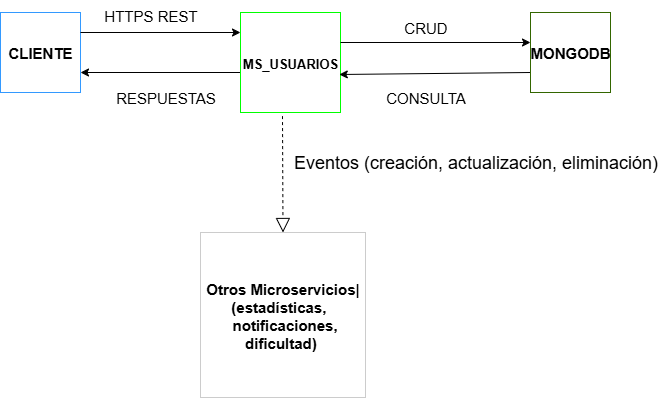

# Microservicio de Usuarios (ms_usuarios)

## 1. Descripción General

El microservicio de usuarios gestiona la información integral de los usuarios del sistema.  
Permite crear, consultar, actualizar y eliminar usuarios, asegurando la integridad y unicidad de datos como el correo electrónico.  
Funciona de forma autónoma dentro de una arquitectura distribuida basada en APIs REST y, opcionalmente, mediante eventos para notificar cambios a otros microservicios.  
La comunicación se realiza mediante HTTPS con certificados autofirmados para mayor seguridad.

---

## 2. Arquitectura y Diagrama Funcional

El microservicio se comunica con otros servicios como autenticación, estadísticas y notificaciones, a través de:

- **REST (síncrono)** para operaciones CRUD.  
- **Mensajería (asíncrona)** para eventos emitidos en cambios de usuarios.

### Flujo Funcional

```
Cliente → ms_usuarios (REST API) → Base de datos (MongoDB)
                          ↓
                  Eventos de usuario (creación, actualización, eliminación)
                          ↓
               Otros microservicios (dificultad, estadísticas, notificaciones)
```
---
### Diagrama Funcional



## 3. Endpoints y Mensajes Emitidos

### Endpoints principales

| Método | Endpoint         | Descripción                      |
|--------|------------------|----------------------------------|
| GET    | /usuarios        | Lista todos los usuarios         |
| GET    | /usuarios/:id    | Obtiene un usuario por ID        |
| POST   | /usuarios        | Crea un nuevo usuario            |
| PUT    | /usuarios/:id    | Actualiza un usuario existente   |
| DELETE | /usuarios/:id    | Elimina un usuario               |

### Mensajes emitidos

Al ocurrir eventos importantes, el microservicio emite mensajes JSON con la siguiente estructura:

```json
{
  "evento": "usuario_creado",
  "usuario_id": "12345",
  "nombre": "Carlos",
  "apellido": "Pérez",
  "correo": "carlos@example.com",
  "genero": "masculino",
  "pais": "Ecuador",
  "timestamp": "2025-06-08T14:30:00Z"
}
```

**Descripción de campos:**

- `evento`: tipo de evento (`usuario_creado`, `usuario_actualizado`, `usuario_eliminado`).
- `usuario_id`: identificador único del usuario.
- `nombre`: nombre del usuario.
- `apellido`: apellido del usuario.
- `correo`: correo electrónico.
- `genero`: género del usuario.
- `pais`: país de residencia.
- `timestamp`: fecha y hora del evento en formato ISO 8601.

---

## 4. Diagrama de la Base de Datos (MongoDB)

La colección principal utilizada por el microservicio es `usuarios`.

| Campo     | Tipo de Dato | Descripción                                 |
|-----------|--------------|---------------------------------------------|
| _id       | ObjectId     | Identificador único generado por MongoDB    |
| nombre    | String       | Nombre del usuario                          |
| apellido  | String       | Apellido del usuario                        |
| correo    | String       | Correo electrónico (único)                  |
| genero    | String       | Género del usuario                          |
| pais      | String       | País de residencia                          |
| timestamp | DateTime     | Fecha de creación o modificación            |

El campo `correo` debe tener un índice único para garantizar la unicidad en la base de datos.

---

## 5. Manual de Despliegue - Microservicio de Usuarios (ms_usuarios)

### ✅ Prerrequisitos

- Docker Desktop instalado (versión 24.x o superior recomendada).
- Puertos 3000 y 27017 disponibles en tu máquina.
- Certificados SSL autofirmados ubicados en la carpeta `/certs`:
  - `solfeapp.edu.ec.crt`
  - `solfeapp.edu.ec.key`
- Archivo `.env` con las variables de entorno necesarias (en la raíz del proyecto).

### 🗂️ Estructura del Proyecto

```
ms_usuarios/
├── certs/
│   ├── solfeapp.edu.ec.crt
│   └── solfeapp.edu.ec.key
├── docs/
│   └── despliegue.md
├── src/
│   └── index.js
├── .env
├── Dockerfile
└── docker-compose.yml
```

### Versiones Utilizadas

| Software           | Versión               |
|--------------------|------------------------|
| Node.js            | 22.15.0               |
| MongoDB Driver     | 6.17.0                |
| dotenv             | 17.2.0                |
| Fastify            | ^5.4.0                |
| @fastify/mongodb   | ^9.0.2                |
| Docker Engine      | 28.0.4                |
| Docker Compose     | 2.34.0-desktop.1      |

### Comandos para el Despliegue

Construir y levantar los contenedores con docker-compose:

```bash
docker-compose up --build
```

Verificar que los contenedores estén corriendo:

```bash
docker ps
```

Deberías ver dos contenedores activos:

- `ms_usuarios_app`
- `ms_usuarios_mongo`

Acceder al microservicio (vía HTTPS):

```bash
https://localhost:3000/usuarios
```

⚠️ Al usar un certificado autofirmado, el navegador mostrará una advertencia de seguridad.

### 🧪 Pruebas Básicas (curl)

**Listar usuarios:**

```bash
curl -k https://localhost:3000/usuarios
```

**Crear un usuario de ejemplo:**

```bash
curl -k -X POST https://localhost:3000/usuarios   -H "Content-Type: application/json"   -d '{"nombre":"Carlos", "correo":"carlos@example.com"}'
```

---

## 6. Dummy del Microservicio de Usuarios (WireMock)

Este dummy simula el comportamiento del microservicio usando WireMock Cloud.

**Base URL del dummy:** `https://5534z.wiremockapi.cloud`

### Endpoints simulados

**1. GET /usuarios**

```bash
curl -X GET https://5534z.wiremockapi.cloud/usuarios
```

**2. POST /usuarios**

```bash
curl -X POST https://5534z.wiremockapi.cloud/usuarios
```

```json
{
  "mensaje": "Usuario creado correctamente",
  "usuario": {
    "id": 3,
    "nombre": "Carlos",
    "apellido": "Ramírez",
    "correo": "carlos@gmail.com",
    "genero": "masculino",
    "pais": "Ecuador",
    "fecha_creacion": "2025-06-08T14:05:00Z"
  }
}
```

**3. PUT /usuarios/3**

```bash
curl -X PUT https://5534z.wiremockapi.cloud/usuarios/3
```

```json
{
  "mensaje": "Usuario 3 actualizado correctamente.",
  "usuario": {
    "id": 3,
    "nombre": "Pedro",
    "apellido": "González",
    "correo": "pedro@mail.com",
    "genero": "masculino",
    "pais": "Chile",
    "fecha_actualizacion": "2025-06-08T14:10:00Z"
  }
}
```

**4. DELETE /usuarios/3**

```bash
curl -X DELETE https://5534z.wiremockapi.cloud/usuarios/3
```

```json
{
  "mensaje": "Usuario Ana eliminado correctamente.",
  "id_eliminado": 3
}
```

---

## 7. Historial de Cambios y Evolución del Servicio

| Fecha       | Versión | Descripción                                                            |
|-------------|---------|------------------------------------------------------------------------|
| 2025-05-27  | 1.0.0   | Versión inicial: implementación básica del CRUD de usuarios con Node.js.|
| 2025-06-08  | 1.3.0   | Emisión de eventos JSON al crear, actualizar o eliminar usuarios.       |
| 2025-06-17  | 1.1.0   | Integración con MongoDB usando @fastify/mongodb.                        |
| 2025-07-09  | 1.2.0   | Inclusión de certificados HTTPS autofirmados para conexión segura.      |
| 2025-07-26  | 1.4.0   | Creación de imagen Docker + configuración en docker-compose.yml.        |
| 2025-07-27  | 1.5.0   | Documentación del diagrama funcional y de base de datos (MongoDB).      |